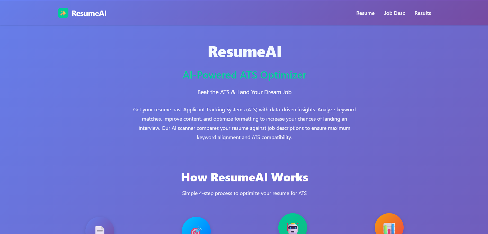
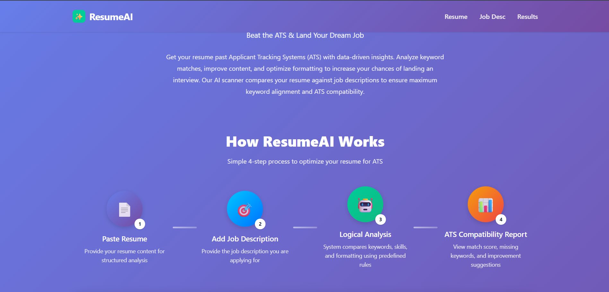
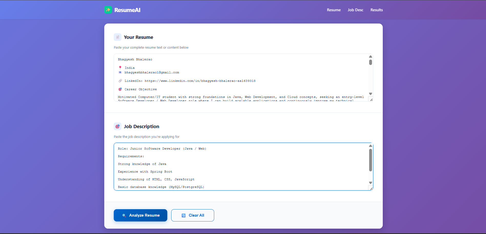
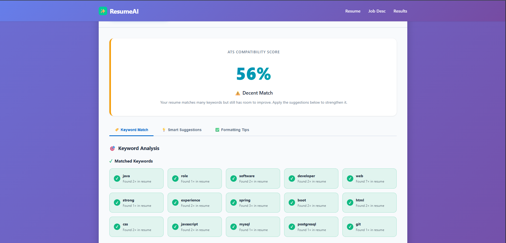
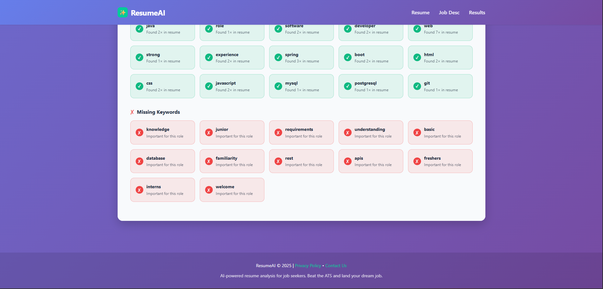

# ResumeAI – ATS Resume Analyzer

ResumeAI is a rule-based ATS (Applicant Tracking System) resume analyzer built using HTML, CSS, and JavaScript.  
It helps job seekers evaluate how well their resume matches a job description using keyword analysis and ATS-friendly logic.

---
## 🌐 Live Demo
🔗(https://resume-ats-optimizer-bvb.netlify.app/)
---
---

## 🖼️ Screenshots (Application Flow)

### 🔹 Home Page

---

### 🔹 How It Works – Guide

---

### 🔹 Analyze Resume Screen

---

### 🔹 ATS Score Result – View 1

---

### 🔹 ATS Score Result – View 2

---
---

## 🚀 Features
- Resume vs Job Description comparison
- ATS compatibility score
- Matched & missing keyword detection
- Formatting and best-practice suggestions
- Clean, responsive UI
- Privacy-focused (no data storage)

---

## 🛠 Tech Stack
- HTML5
- CSS3 (Custom Design System)
- JavaScript (Rule-based logic)

---

## 📊 How It Works
1. Paste resume content
2. Paste job description
3. System performs keyword and rule-based analysis
4. Generates ATS score and improvement suggestions

> Note: This project uses **rule-based logic**, not machine learning or AI models.

---

## 🔒 Privacy
User data is processed temporarily in the browser and is not stored or shared.

---

## 📬 Contact
**Bhagyesh Bhalerao**  
📧 Email: bhagyeshbhalerao1@gmail.com  
🔗 LinkedIn: https://www.linkedin.com/in/bhagyesh-bhalerao-aa1639318

---

